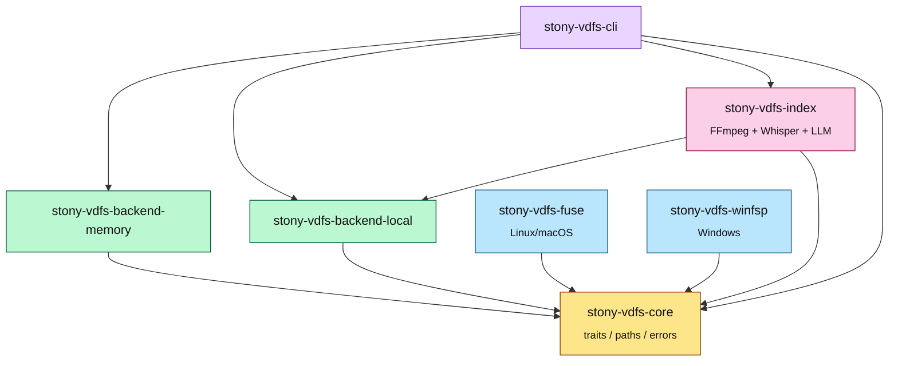
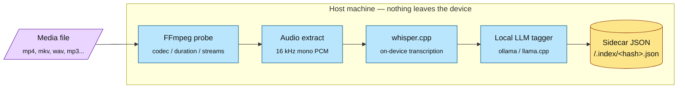
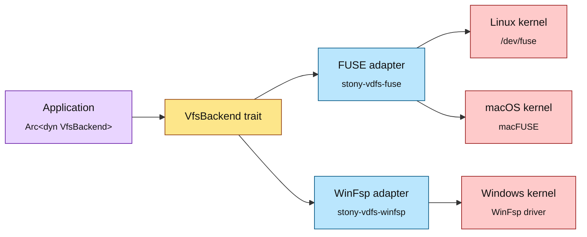
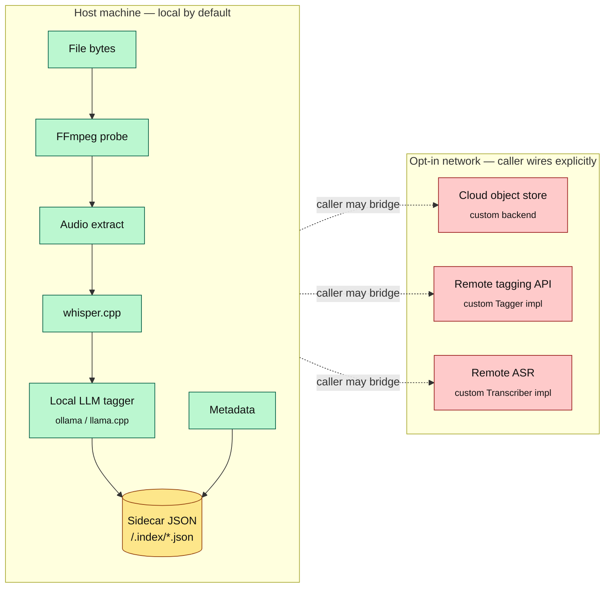

# Architecture

This document explains the design choices behind `stony-vdfs` and how the crates fit
together. It is aimed at someone considering adopting the library in a downstream
project, or contributing to its core.

## Crate dependency graph

The workspace has one trait crate and seven dependents. Every arrow points "depends on";
the core crate has no IO dependencies of its own.



## Design goals (in priority order)

1. **Privacy by default.** The library never calls a remote service unless the caller
   explicitly hands it a remote-aware backend. There is no telemetry, no analytics, no
   update check.
2. **Async-first.** Every IO method returns a future. The library targets `tokio` and
   does not try to be runtime-agnostic — that flexibility usually costs more than it
   buys.
3. **Backend-agnostic.** The `VfsBackend` trait is the only thing application code
   touches. Whether the bytes live in RAM, on disk, in a content-addressable blob store,
   or on a remote object store is a configuration choice, not an API choice.
4. **Cross-platform parity.** A test that passes on Linux passes on macOS and Windows,
   modulo features explicitly gated behind `#[cfg]`. Backends own their platform quirks.
5. **Small core.** `stony-vdfs-core` depends on the minimum: `thiserror`, `bytes`,
   `bitflags`, `async-trait`, `time`, `tracing`, plus the `sync` and `rt` features of
   `tokio`. No IO. No `std::fs`. No FUSE.
6. **Composability over inheritance.** Decorators (caches, encryption, CAS) wrap any
   backend. The trait does not need new methods to support them.

## The trait hierarchy

```rust
pub trait VfsBackend: Send + Sync + 'static {
    fn name(&self) -> &'static str;
    async fn metadata(&self, path: &VfsPath) -> Result<VfsMetadata>;
    async fn list(&self, path: &VfsPath) -> Result<Vec<VfsPath>>;
    async fn open(&self, path: &VfsPath, flags: OpenFlags) -> Result<Box<dyn VfsHandle>>;
    async fn create_dir(&self, path: &VfsPath) -> Result<()>;
    async fn remove(&self, path: &VfsPath) -> Result<()>;
}

pub trait VfsHandle: Send + Sync {
    async fn read(&mut self, offset: u64, len: usize) -> Result<Bytes>;
    async fn write(&mut self, offset: u64, data: &[u8]) -> Result<usize>;
    async fn flush(&mut self) -> Result<()>;
}
```

A few deliberate choices to call out:

- **Random-access read/write.** `read` and `write` take an explicit offset. Streaming on
  top of this is trivial (the CLI does it in 16 KiB chunks); the inverse — implementing
  random access on top of a streaming interface — is much harder for backends that
  could otherwise support it natively.
- **`Box<dyn VfsHandle>` not associated type.** An associated type would let us avoid
  the heap allocation per handle, but it forces every caller to be generic over the
  backend type. Application code typically wants `Arc<dyn VfsBackend>`, and the boxed
  handle keeps that ergonomic. The allocation cost is dominated by IO cost in every
  realistic workload.
- **Async traits via `async_trait`.** Native async traits in Rust 2024 still don't
  support `dyn` compatibility cleanly, and the `async_trait` macro is well understood
  and stable. We will switch to native syntax when the compatibility lands.
- **No `rename`/`copy`/`set_metadata` in v0.1.** The core trait stays small until M2,
  when those operations land with cross-platform semantics already documented. Backends
  may implement them today as inherent methods; the trait surface will catch up.

## Why `VfsPath` and not `std::path::Path`?

`std::path::Path` carries the platform's separator and case-sensitivity conventions
into application code. That is the right behaviour for code that touches the host
filesystem directly, but it is the wrong behaviour for code that should behave the same
on every host. `VfsPath`:

- always uses `/` as separator,
- is always absolute,
- normalizes `\` to `/` and collapses `//`,
- never decays to a `&str` with a platform-specific separator,
- bridges to `std::path::PathBuf` only at backend boundaries (the local backend does
  this; application code does not have to).

Cross-platform test fixtures that mix Windows and POSIX paths are a chronic source of
bugs in tools that touch many backends. Going through `VfsPath` makes the bug
impossible to express.

## Concurrency model

The library follows the standard `tokio` shape: backends are `Send + Sync + 'static`,
cheap to clone (typically wrapping an `Arc`), and operations are independent. Handles
are not `Sync` but are `Send`; callers move them between tasks rather than sharing them.

Mutex choice:

- `parking_lot::RwLock` for the in-memory backend (sync, fast, no `await` while holding).
- `tokio::sync::Mutex` for the local backend's file handles (we need to hold across
  `.await` for `seek + read/write`).

No backend allows blocking IO from inside the runtime; the local backend uses
`tokio::fs`, which delegates to the blocking pool transparently.

## Error handling philosophy

`VfsError` is one type with rich variants, not an opaque trait object. Three reasons:

1. **Pattern-matchable.** Callers can branch on `NotFound` vs `PermissionDenied`
   without downcasting.
2. **Stable for bridging.** Each variant maps onto a `std::io::ErrorKind`, so bridging
   to the standard library is a `match` away.
3. **Cheap.** Every variant carries the offending `VfsPath` as a `String`, which costs
   one allocation on the error path — same cost as `std::io::Error::new(_, message)`.

`Result<T> = std::result::Result<T, VfsError>` is exported from `stony-vdfs-core` and
re-exported everywhere — callers should never need to qualify the error type.

## Indexing pipeline flow

When a media file is written through the indexing decorator, the bytes traverse four
stages — all on the local device — before a sidecar JSON record is persisted alongside
the file. Each stage is a trait; callers can swap any implementation.



## Mount adapter architecture

User-space mount points share a single trait surface: each adapter translates kernel
callbacks (FUSE on Linux/macOS, WinFsp on Windows) into `VfsBackend` calls. The kernel
sees a regular filesystem; the application sees an `Arc<dyn VfsBackend>`.



## Privacy considerations

Privacy is a design constraint, not a feature. Concretely:

- No network calls in the core or in the default backends.
- No environment variable, network adapter, or system identifier is read except where
  the standard library's documented behaviour requires it (e.g. `tokio::fs::metadata`
  on Linux reads `/proc`).
- The optional `tracing` integration produces `INFO`-level events with no PII unless
  the caller's `tracing-subscriber` is configured to also capture paths or buffers.
- The CAS and encryption layers (M5) carry their own threat model in
  `docs/THREAT_MODEL.md`. The short version: encryption protects data at rest in an
  untrusted backend; it does not protect the contents from the host process or from a
  caller that mishandles its `KeyProvider`.

### Privacy contract — what stays local, what is opt-in network

The diagram below draws the host-machine boundary explicitly. The library's default
posture keeps everything on the left. Anything on the right only happens when the
calling application wires in a network-aware backend or tagger.



The library itself never opens a socket. Telemetry, analytics, and update checks are
absent by construction — they are not features that can be toggled off, they are code
that does not exist in the workspace.

## Future extensibility

These are deliberate hooks, not promises:

- **Content-addressable storage.** The `VfsBackend` trait does not expose hashes today,
  but `stony-vdfs-cas` (M5) will provide an additional trait that CAS-aware backends
  implement. Non-CAS backends pass through unchanged.
- **Optional encryption.** A decorator backend wraps any other backend and encrypts
  on write / decrypts on read. The trait does not change.
- **Sync-friendly metadata.** Vector clocks or content hashes can ride along in the
  `VfsMetadata` struct via additional `Option` fields without breaking existing code.
- **Plugin backends.** Because `Arc<dyn VfsBackend>` is the public surface, plugins —
  whether dynamically loaded, WASM-hosted, or RPC-fronted — can implement the trait
  exactly the same way as in-tree backends.

## What this design explicitly is *not*

- It is **not** a synchronization framework. CRDTs, vector clocks, and merge logic live
  above this library.
- It is **not** a cloud abstraction. There are no S3 backends in-tree, and there
  intentionally won't be in v1. If you want S3, write a backend; the trait is small.
- It is **not** a journaling filesystem. Atomicity and durability are the host
  filesystem's job; we expose them where backends support them, and document where they
  don't.
- It is **not** a database. We don't promise transactional semantics across `open` /
  `write` / `flush` boundaries; if you need that, build it as a decorator.

The smaller these promises are, the more honest the library can be about delivering on
them.
